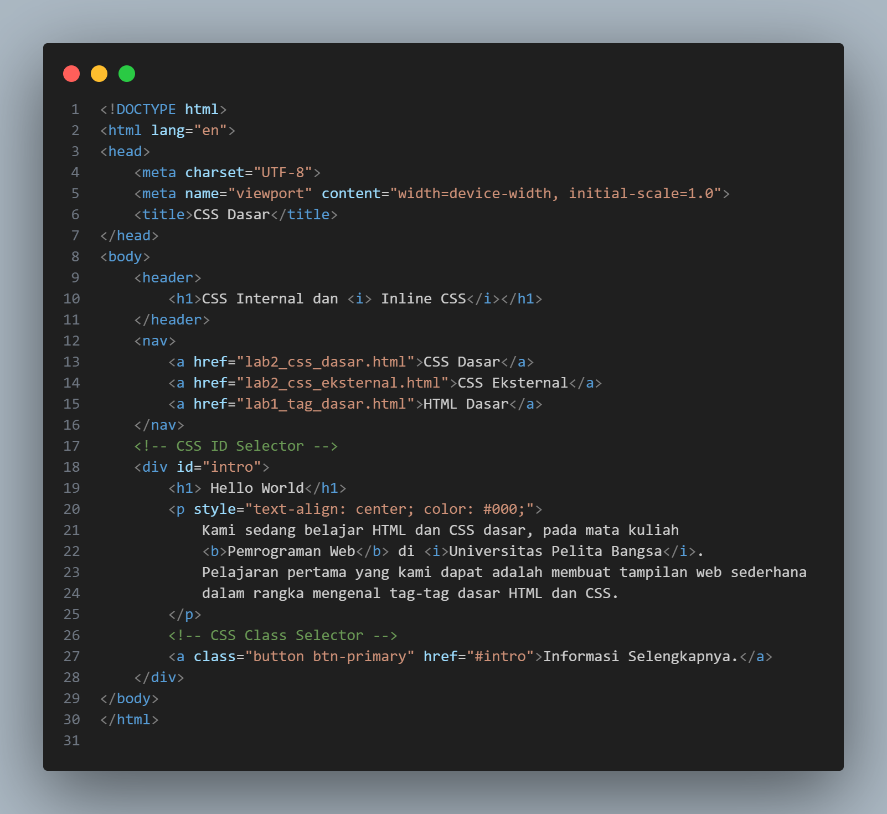
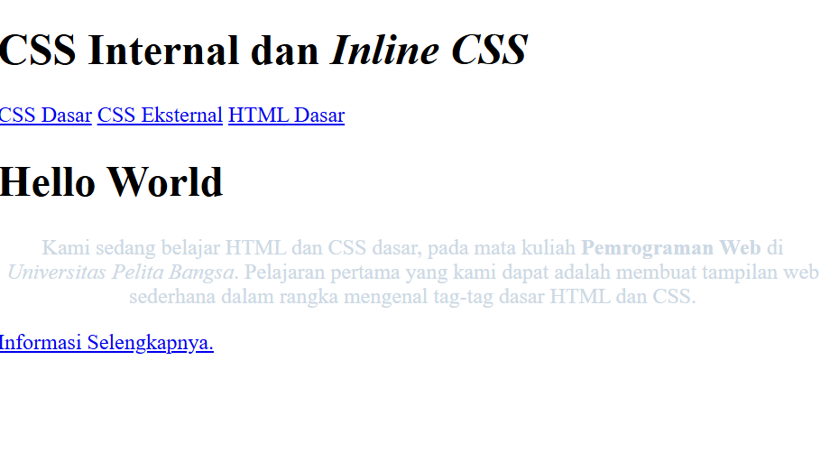
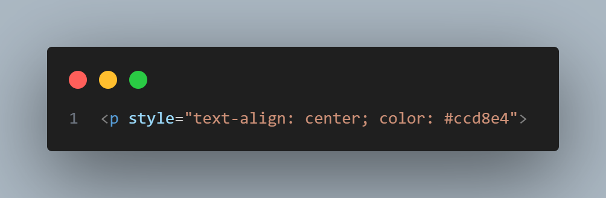
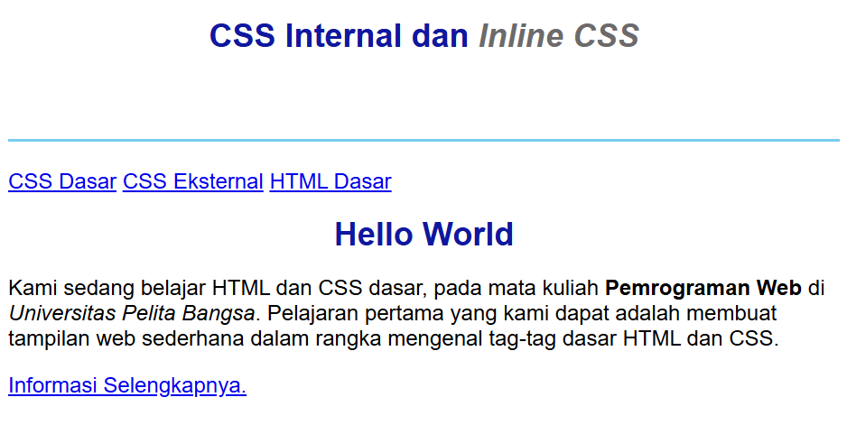
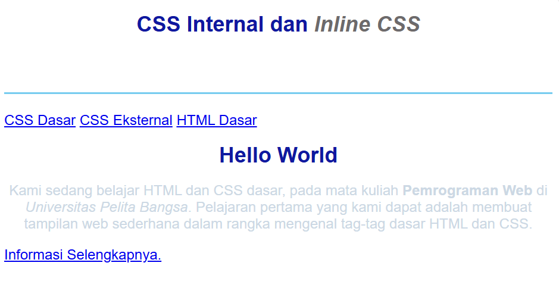
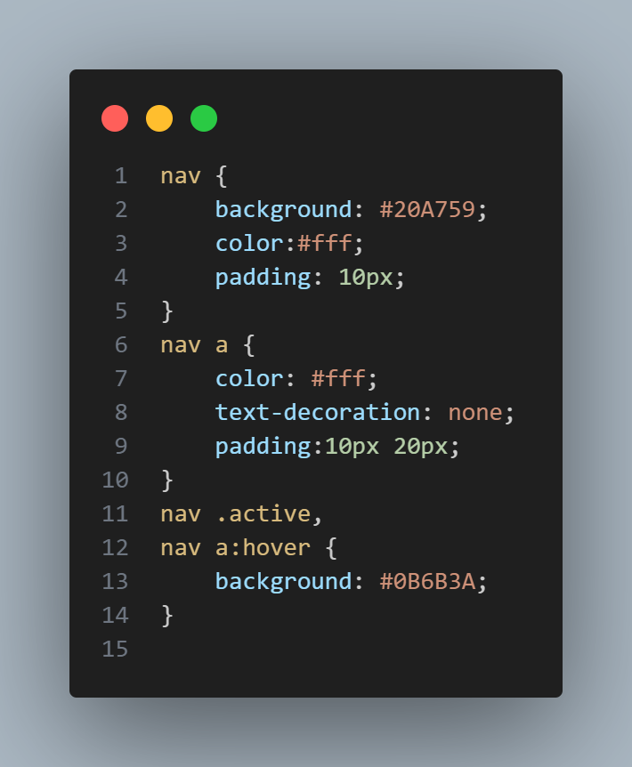
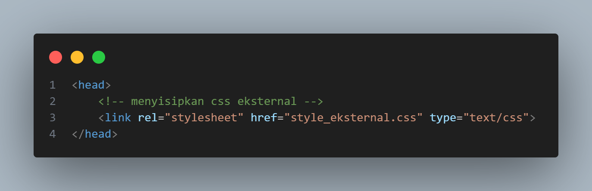
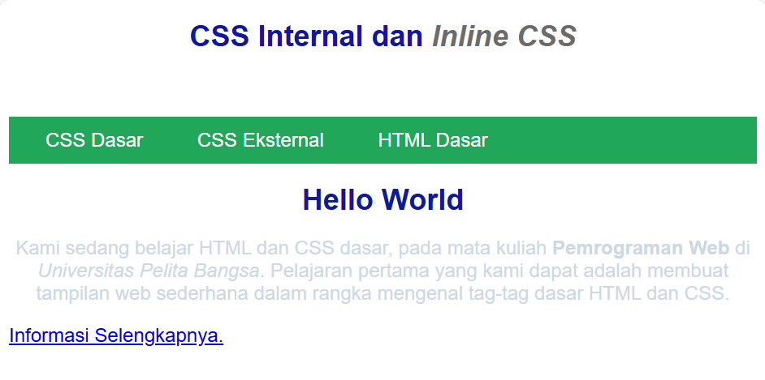
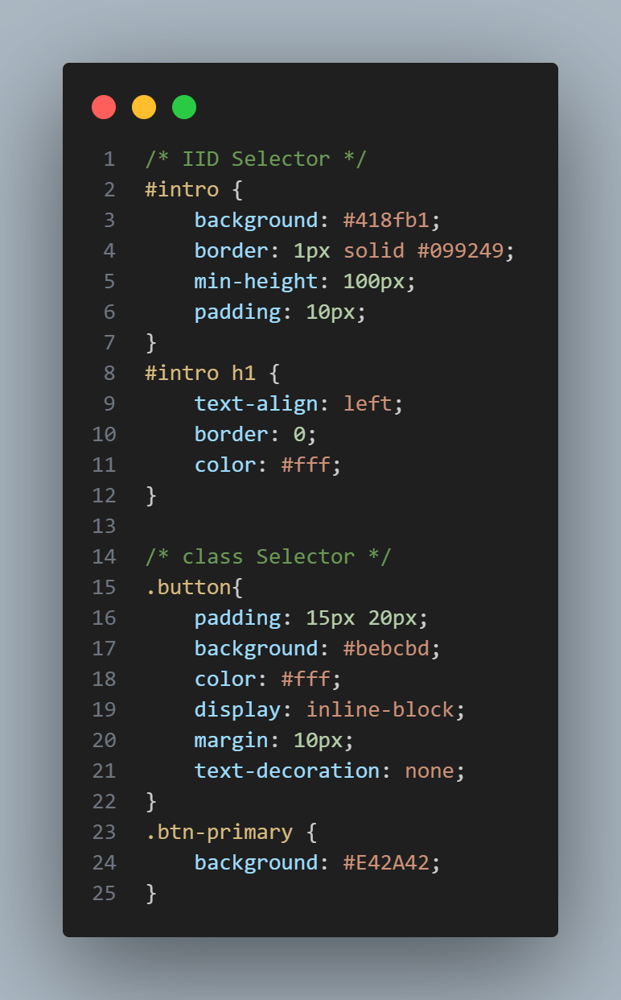
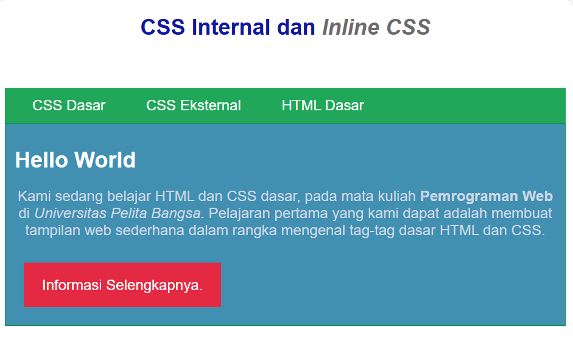

# LAPORAN PRAKTIKUM 2
DAFTAR ISI
==========
- [LAPORAN PRAKTIKUM 1](#laporan-praktikum-1) 
    - [LATAR BELAKANG CSS DASAR](#latar-belakang-css-dasar)
    - [STRUKTUR CSS](struktur-css)
    - [ATURAN PENULISAN CSS](aturan-penulisan-css)
    - [PRAKTIKUM CSS DASAR](#praktikum-css-dasar)
    - [TANYA JAWAB SOAL CSS DASAR](#tanya-jawab-soal-css-dasar)
    - [KESIMPULAN](#kesimpulan)

## LATAR BELAKANG CSS DASAR
Cascading Style Sheet (CSS) merupakan aturan untuk mengatur beberapa komponen dalam sebuah
web sehingga akan lebih terstruktur dan seragam. CSS bukan merupakan bahasa pemograman. CSS
memudahkan dalam mengubah tampilan di berbagai halaman. Hanya dengan mengubah fungsi
style di file CSS maka seluruh tampilan yang menggunakan fungsi tersebut akan berubah secara
otomatis. CSS mempunyai atribut lebih beragam dibandingkan dengan HTML CSS memungkinkan
konten dapat dioptimasi di lebih dari satu perangkat. Hampir seluruh website yang ada di internet
menggunakan CSS di dalamnya. Selain tampilannya yang lebih menarik, kebanyakan browser
populer saat ini juga mendukung CSS.

## STRUKTUR CSS DASAR
Perintah CSS terdiri atas 2 komponen, yakni Selector & Declaration. Selector berfungsi untuk
memberi tahu browser bahwa pada elemen mana rule CSS diterapkan. Selector dapat berupa
elemen HTML, selector class atau selector id. Declaration merupakan aturan CSS yang diterapkan,
terdiri atas property dan value.

## ATURAN PENULISAN CSS DASAR
Penulisan CSS dapat dilakukan dengan tiga cara, yaitu penulisan secara internal, external dan inline.
Internal adalah kode CSS ditulis pada dokumen HTML pada bagian head dokumen. External CSS
adalah kode CSS ditulis terpisah dengan dokumen HTML berupa file Style Sheet (.css). Sedangkan
Inline CSS adalah kode CSS ditulis sebagai artribut pada tag HTML.

### PRAKTIKUM CSS DASAR
Repository ini berisi hasil praktikum Pemrograman Web **Praktikum 2 - CSS Dasar**.  
Tujuan dari praktikum ini adalah memahami konsep dasar CSS, aturan penulisan CSS, penggunaan selector (elemen, class, id), serta penerapan CSS internal, inline, dan eksternal.

### Langkah 1: Membuat HTML Dasar
Membuat file `lab2_css_dasar.html` berisi struktur dasar HTML, header, dan navigasi.

# Input:

# Output :
Halaman menampilkan judul, menu navigasi, dan teks perkenalan sederhana tanpa styling tambahan.

### Langkah 2: Menambahkan Internal CSS
Menambahkan CSS internal pada bagian <head> menggunakan tag <style>.

# Input:

# Output :
Sekarang tampilan judul menjadi rata tengah dengan warna biru, ada garis bawah pada header, dan font lebih rapi.

### Langkah 3: Menambahkan Inline CSS
Menambahkan CSS langsung di dalam tag `
` menggunakan atribut `style`.

# Input:

# Output :
Teks paragraf ditampilkan dengan warna abu-abu muda dan posisi rata tengah.

### Langkah 4: Membuat Eksternal CSS
Membuat file baru `style_eksternal.css` kemudian menambahkan kode berikut:

# Input:

Kemudian di file HTML saya hubungkan dengan:

# Output :
Navigasi sekarang memiliki background hijau, tulisan putih, dan ketika diarahkan mouse warnanya berubah lebih gelap.

### Langkah 5: Menambahkan Selector (ID & Class)
Menambahkan selector ID dan class pada file `style_eksternal.css`.

# Input:

# Output :
# - Area intro sekarang punya background biru dan teks judul jadi putih.

# - Tombol "Informasi selengkapnya" punya style khusus dengan warna merah.

### TANYA JAWAB SOAL CSS DASAR

# 1. Lakukan eksperimen dengan mengubah dan menambah properti dan nilai pada kode CSS dengan mengacu pada CSS Cheat Sheet yang diberikan pada file terpisah dari modul ini.

Jawab: Dalam eksperimen, kita bisa menambahkan properti seperti background-color, text-transform, atau letter-spacing untuk melihat efeknya pada tampilan. Misalnya h1 awalnya hanya biru dan rata tengah, lalu diberi latar abu-abu, huruf kapital semua, serta jarak antar huruf lebih lebar, hasilnya teks jadi lebih menonjol dan mudah dibaca. Eksperimen ini penting untuk memahami bagaimana tiap properti memengaruhi estetika dan keterbacaan halaman web. 

# 2. Apa perbedaan pendeklarasian CSS elemen h1 {...} dengan #intro h1 {...}? berikan penjelasannya!

Jawab: Selector h1 {} berlaku untuk semua elemen <h1> di halaman, sedangkan #intro h1 {} hanya berlaku untuk <h1> yang ada di dalam elemen ber-ID intro. Karena lebih spesifik, aturan #intro h1 akan mengalahkan aturan h1 jika keduanya mendeklarasikan properti yang sama. Ini menunjukkan prinsip spesifisitas dalam CSS, di mana selector yang lebih terarah memiliki prioritas lebih tinggi.

# 3. Apabila ada deklarasi CSS secara internal, lalu ditambahkan CSS eksternal dan inline CSS padaelemen yang sama. Deklarasi manakah yang akan ditampilkan pada browser? Berikan penjelasan dan contohnya!

Jawab: Jika satu elemen mendapat style dari eksternal, internal, dan inline CSS, maka browser memilih berdasarkan urutan prioritas: inline paling kuat, lalu internal, lalu eksternal. Misalnya paragraf diberi warna biru di eksternal, hijau di internal, dan merah lewat inline (style="color:red"), maka yang tampil adalah merah. Aturan ini mengikuti konsep cascade, yaitu style dengan tingkat spesifisitas atau posisi lebih tinggi akan menang.

# 4. Pada sebuah elemen HTML terdapat ID dan Class, apabila masing-masing selector tersebutterdapat deklarasi CSS, maka deklarasi manakah yang akan ditampilkan pada browser?Berikan penjelasan dan contohnya! ( 
 ) bantu saya jawab soal ini

Jawab: Jika sebuah elemen memiliki ID dan class sekaligus, dan keduanya mengatur properti yang sama, maka aturan ID akan lebih diutamakan karena spesifisitasnya lebih tinggi. Contohnya 
 akan tampil merah jika ID memberi warna merah, meski class memberi warna biru. Namun properti yang berbeda dari class tetap berlaku, sehingga biasanya class digunakan untuk style yang berulang, sementara ID dipakai untuk elemen khusus.

## KESIMPULAN
Dari praktikum CSS dasar dapat disimpulkan bahwa penggunaan CSS sangat penting untuk mengatur tampilan halaman web agar lebih menarik, rapi, dan konsisten. CSS dapat ditulis dalam tiga cara, yaitu inline, internal, dan eksternal, dengan urutan prioritas penerapan: inline > internal > eksternal. Selector juga memiliki peran penting dalam menentukan gaya yang diterapkan, di mana selector ID memiliki spesifisitas lebih tinggi dibandingkan class maupun elemen biasa, sehingga lebih diutamakan jika terjadi konflik. Eksperimen penambahan properti CSS membantu memahami bagaimana setiap aturan memengaruhi desain, misalnya warna, jarak, ukuran huruf, atau tata letak. Dengan memahami prinsip cascade, inheritance, dan specificity, seorang web developer dapat menuliskan kode CSS yang lebih efektif, terstruktur, serta mudah dikelola dalam pengembangan web jangka panjang.

